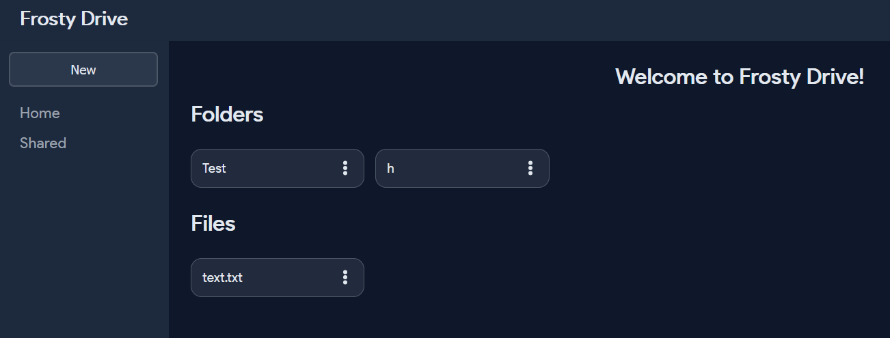
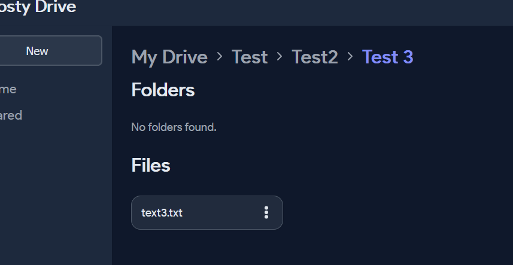
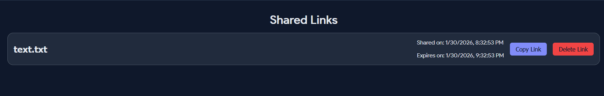

# File Uploader (Google-Drive like)

## Live Demo
[Live Demo Link](https://file-uploader-two-navy.vercel.app/)

## Description
An application that allows users to upload, manage, and share files, similar to Google Drive. Uses EJS templating, it features user authentication, protected routes, and CRUD operations for file management. Users can sign up,upload files and manage nested folders and subfolders, share files with other users and download files/folders. 

## Tech Stack
- Node.js
- Express
- EJS Templating
- Prisma ORM
- Multer for file uploads
- Supabase

## Features
- Authentication
- Protected routes
- CRUD operations
- File uploads
- Folder and subfolder management
- File sharing

## Screenshots

