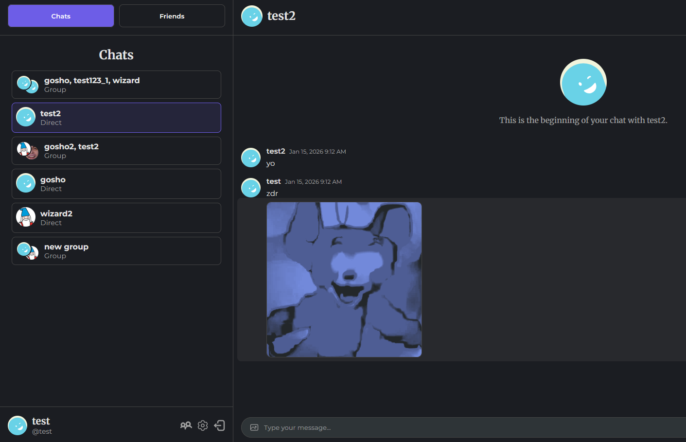
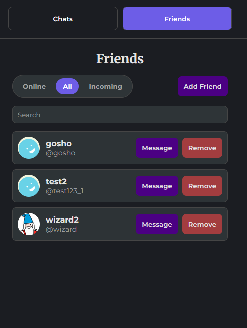

# Messaging App

## Live Demo
[Live Demo Link](https://odin-projects-vsez.vercel.app/)

## Description
A real-time messaging application built with React and Node.js, featuring user authentication, protected routes, and CRUD operations. Users can sign up, send messages, send friend requests and create group chats. The app also supports file uploads and real-time messaging using Socket\.io. Supabase is used for storage, while Prisma ORM handles database interactions.

## Tech Stack
- React
- Node.js
- Express
- Socket\.io
- Supabase
- Prisma ORM

## Features
- Authentication
- Protected routes
- CRUD operations
- File uploads
- Real-time messaging

# Screenshots

