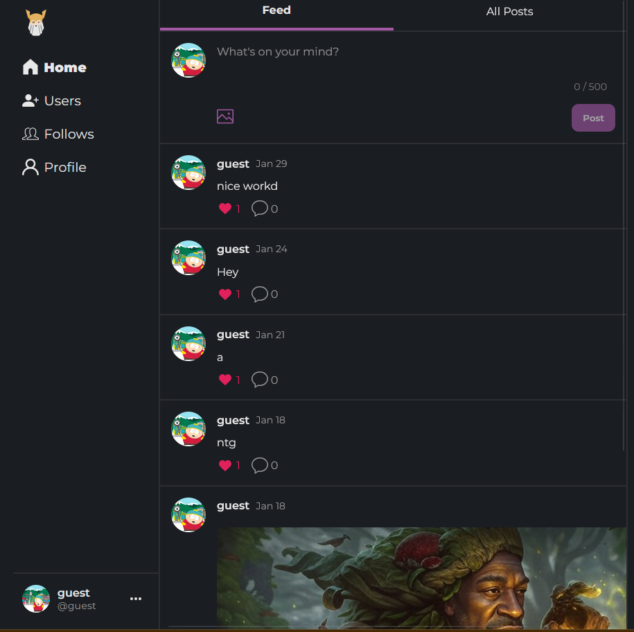
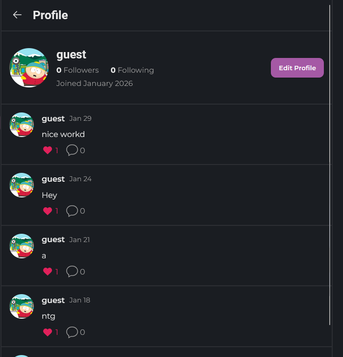
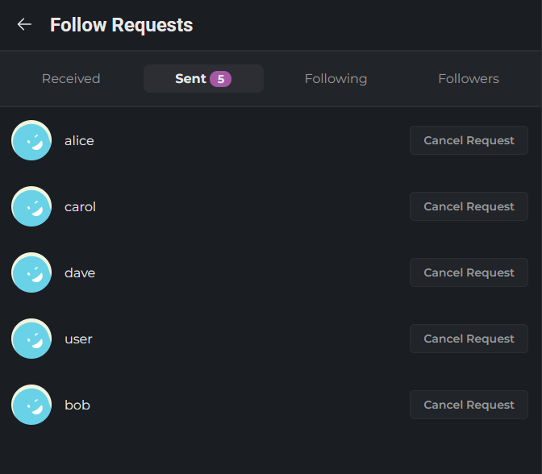
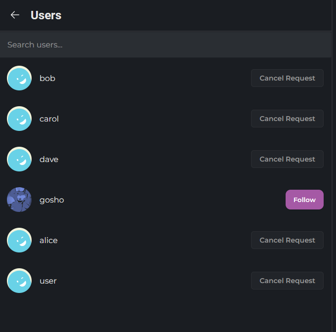
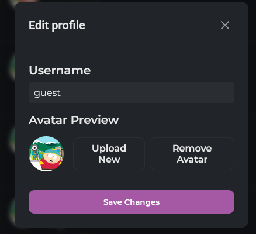

# Social Platform

## Live Demo
[Live Demo Link](https://odin-book-frontend-three.vercel.app/)

## Description
A social platform built with React and Node.js, featuring user authentication, protected routes, and CRUD operations. Users can sign up, create and like posts and comments, follow other users and upload images. Database is hosted on Neon and images are stored on Cloudinary.

## Tech Stack
- React
- Node.js
- Express
- React Query
- Prisma ORM
- Neon (PostgreSQL)
- Cloudinary

## Features
- Authentication
- Protected routes
- CRUD operations
- File uploads
- Follow system
- Like system

## Screenshots

